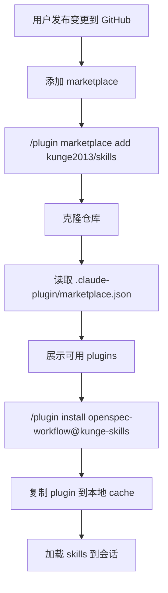

# plugin-marketplace-setup — v1（2026-06-26）

## 1. 接口定义

本变更为纯基础设施类变更，无 Controller/API 接口。涉及以下文件结构：

| 字段 | 值 |
|------|----|
| 类型 | 项目结构重构 |
| 变更范围 | 目录结构、配置文件、文档 |
| 影响 | 用户可通过 GitHub 安装 skills |

## 2. 业务流程图

## 3. 业务逻辑详情

### 3.1 Marketplace 配置逻辑

marketplace.json 是 Claude Code 识别插件市场的入口文件，包含：
- marketplace 名称（`kunge-skills`）作为用户安装时的标识符
- owner 信息（维护者姓名和邮箱）
- plugins 数组定义每个 plugin 的 source、描述、元数据

### 3.2 Plugin 发现与加载逻辑

1. 用户执行 `/plugin marketplace add kunge2013/skills`
2. Claude Code 从 GitHub 克隆仓库
3. 读取 `.claude-plugin/marketplace.json`
4. 解析 plugins 数组，展示可用插件列表
5. 用户执行 `/plugin install <name>@kunge-skills`
6. 复制对应 plugin 目录到本地 `~/.claude/plugins/cache/`
7. 读取 `plugin.json`，发现 `skills/` 目录
8. 加载所有 SKILL.md 到用户会话

### 3.3 版本策略

不设置 `version` 字段，Claude Code 自动使用 git commit SHA 作为版本标识：
- 每次 push 到 main 即为新版本
- 用户执行 `/plugin marketplace update` 获取最新内容
- 零维护成本，push 即发布

### 3.4 插件独立性

两个 plugin（openspec-workflow 和 openspec-trace）完全独立：
- 用户可按需安装其中一个或全部
- 无交叉依赖
- strict mode 使用默认值 `true`，plugin.json 作为权威定义

## 4. 表结构 ER 图

本变更为基础设施类，不涉及数据库表结构。

## 5. 源码文件清单

| 文件 | 类型 | 说明 |
|------|------|------|
| `.claude-plugin/marketplace.json` | 配置 | Marketplace 入口文件 |
| `plugins/openspec-workflow/plugin.json` | 配置 | openspec-workflow 插件 manifest |
| `plugins/openspec-trace/plugin.json` | 配置 | openspec-trace 插件 manifest |
| `plugins/openspec-workflow/skills/openspec-explore/SKILL.md` | 技能 | 探索模式技能 |
| `plugins/openspec-workflow/skills/openspec-propose/SKILL.md` | 技能 | 提案生成技能 |
| `plugins/openspec-workflow/skills/openspec-apply-change/SKILL.md` | 技能 | 任务实施技能 |
| `plugins/openspec-workflow/skills/openspec-archive-change/SKILL.md` | 技能 | 变更归档技能 |
| `plugins/openspec-trace/skills/opst-code-anysic/SKILL.md` | 技能 | 代码分析归档技能 |
| `plugins/openspec-trace/skills/opst-business-search/SKILL.md` | 技能 | 业务搜索技能 |
| `README.md` | 文档 | Marketplace 安装文档 |
